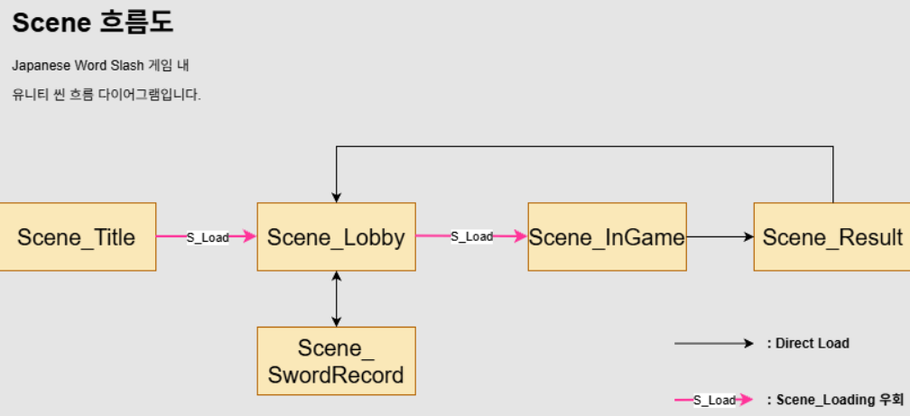

# Japanese Word Slash Game

## 프로젝트 소개
Unity를 이용해 일본어를 최대한 쉽고 재미있게 배울 수 있도록 만든 단어 학습 미니 게임입니다.

한글 뜻을 입력하면 일본어 한자를 들고있는 적에게 공격을 가하고 점수를 얻는 게임을 구현 할 예정입니다.

## 제작 목적
-Unity 기초 쌓기

-미니 프로젝트 제작 경험 만들기

## 사용 기술
-Unity

-Unity에 내재된 C#

-폰트

-일본어 한자 외부 데이터 관리

## 진행 상황
#Repository 생성 (2026 02 19 완료)

프로젝트 기획

기본 UI 구성

일본어 단어 랜덤으로 출제 구현

점수 시스템 구현

## 느낀점
2026 02 19 Repositoy를 처음 생성해서 설렌다.

## 개발 기록
### 3/1
- 프로젝트 구조 설계 및 기획

### 3/9
- 일본어 한자 지원을 위해 외부 폰트를 가져와 적용하고 메인 폰트로 지정

- TextMeshPro의 Fallback Font를 활용하여 또 다른 서브폰트를 적용하여 메인 폰트의 미지원 문자 깨짐 문제 해결

### 3/11
- 일본어 단어(test: 食べる)에 대한 사용자의 입력 기반 정답 판별 기능 구현 (InputField 를 통해 엔터 입력 처리 및 결과 출력 구현)

### 3/12
- 사용자 입력으로 정답 입력시 Enemy 오브젝트 제거 로직 구현

- EnemyController을 통한 Enemy 이동 기능 구현

### 3/13 
- Collider2D 및 Rigidbody2D를 활용한 Enemy - Player 충돌 감지 시스템 구현

### 3/15 ~ 3/17
- Enemy Generator를 통해 설정 시간 간격으로 Enemy 스폰 시스템 구현

- EnemyData 클래스를 정의해 Enemy와 단어 데이터(한자, 한글 뜻)를 구조적으로 처리 및 활용

- EnemyListManager를 통한 리스트 기반 EnemyData 데이터 관리 시스템 구현

- foreach 순회를 활용한 정답 매칭 및 해당 First Correct Enemy 오브젝트 제거 로직 구현

- TextMeshPro UI를 활용하여 Enemy 하단에 한자 단어를 표시하는 시각적 요소 구현

### 3/19
- Enemy 제거 이벤트 기반 점수 누적 시스템 구현
  
- Enemy 제거 즉각 피드백 UI 구현

- UI 피드백 로직을 DeathUIManager로 분리하여 추후 확장성 확보

### 3/24
- 플레이어 체력 감소 및 체력바 UI 구현

- 게임 오버 이벤트 구현 (Enemy 전부 삭제, 사용자 입력창 비활성화, Enemy 스폰 중지 기능 등)

### 3/25
- 외부 단어 파일 JSON 추가 및 로드

### 3/26
- JSON 단어 일부 랜덤 추출 기능 구현

- Enemy와 JSON 단어 연동

- 오브젝트 내 기본 애니메이션 추가

### 4/11
- 프로토타입 씬 내 Attack 애니메이션 로직 구현 및 내부 기능 테스트

- Animation 컨트롤 스크립트 구조 수정

### 4/13
- 메인 씬 플레이어 공격 및 애니메이션 적용

### 4/15
- 프로토타입 씬 내 Popup 기능 구현 완료 및 테스트

### 4/16
- Popup -> Modal 수정
  
- 프로토타입 씬 내 Alert 및 Confirm Modal 추가 구현

### 4/18 ~ 4/20
- Enemy Death 피드백 코드 수정

- Enemy 데이터 관리 구조 이전 및 코드 수정: Scriptable Object 사용

### 4/21 ~ 4/22
- 한글 뜻 힌트 가이드 시스템 추가: 해당 단어 마다 힌트 활성화 Coroutine 개별 시행

### 4/23
- 힌트 시스템의 생성, 숨김 처리 시 Fade 연출 효과 추가

- Blink 연출 추가: 힌트 지속시간이 페이드 인/아웃 합계 시간보다 짧을 경우, 애니메이션이 끝나기 전 데이터 삭제 방지. Blink 모드 자동 전환 로직을 추가

- 추후 Fade Out 시, 연속 깜빡임 효과 추가

### 5/2
- 로비 씬 내 슬라이더 바 UI 그룹 배치 및 기능 추가

### 5/3
- 5가지 슬라이더 바 게임 설정 UI 및 스크롤 뷰 추가

-로비 씬 내 스크롤 뷰 및 下, 中, 上 난이도 버튼 추가

- 버튼 클릭 시 난이도에 맞는 추천 게임 값(슬라이더 바) 자동 설정 기능 구현

### 5/5
- 로비 씬 내 시작 버튼 추가 및 슬라이더 바 사용자 설정 추합, 반영 로직 구현

- 추후 인게임 씬 내 사용 (SO)

### 5/6 ~ 5/7
- 로비 씬 사용자 설정 값 인게임 씬 내 적용

- : 출제 단어 수, 플레이어 체력, 적 이동속도, 적 스폰 딜레이, 제한 시간, 힌트 활성화 시간

- 타이머 추가

### 5/8 ~ 5/10
- 게임 난이도 세팅 별 보상 지급 시스템 구현

- 6가지 게임 설정 및 난이도 계수, 계산식 설계

- [난이도 설정별 보너스(리워드) 시스템 설계] 참조

### 5/11
- 인게임 씬 및 결과 출력 씬 연결

- 내부 함수 수정

### 5/12 ~ 5/14
- 스크립트 내 도감화 기능 설계

- 인 게임 단어 선택: 한번이라도 보지 못한 새로운 단어 먼저 출제되도록 구현

- 추후 도감화 씬 및 UI 구현 예정

- 단어별 정답률 계산 및 저장 기능 구현

### 5/15
- Sword Record 씬 (도감 씬) 추가

- 인게임 씬 전투 시 다뤘던 단어를 카드 UI 형태로 모아 볼 수 있도록 구현

### 5/16
- 인게임 씬 진입 이전 씬 구분, 판단 로직 추가

- 인게임 내 가져올 단어를 새 단어로 할지, 기존 Sword Record 복습 단어로 쓸지 판단하고 출제되도록 구현

### 5/17
- Sword Record 씬 내 복습 단어 자율 선택 및 인게임 씬 내 적용 가능하도록 구현

### 5/18
- Sword Record 내 복습 단어 설정 시 나머지 게임 세부 설정 가능하도록 구현 (로비 씬 재사용 및 새 단어 설정 Block)

- 출제 단어: 새 단어 또는 복습 단어 선택 기능 구현

### 5/20
- Sword Record 복습 단어 선택 확인 알림 창 및 0개 선택 Block 기능 추가

- 복습 단어 세팅 스크립트 일부 수정

### 5/21
- Sword Record 단어 오브젝트 풀링 구현 (유지 보수, 메모리 효율 증가)

### 5/22
- Sword Record 씬 단어 검색 및 해당 카드 UI 호출 기능 추가

- 오브젝트 풀링 메서드 재사용

### 5/24 ~ 5/25
- 로딩 씬 추가 (Scene_Loading)

### 5/26
- 전체 씬 전환 방식 수정: 비동기 씬 로드 (Async)

- 씬 흐름도 차트 추가 (시스템 흐름도 (System Flowchart) 참고)

### 5/27
- In Game씬: 전투 시작 전 출제 단어 목록 지령서 (Word Board) UI 추가 및 표시

- Word Board 전투 시작 확인 버튼 이벤트 처리 (적 스폰, 타이머 활성화 등)

- Sword Reocrd 씬: 단어 검색 시 검색 텍스트 강조 기능 추가

### 5/28
- Sword Record 씬 내 단어 선택 개수 알림 텍스트 추가

- 시스템 단어 최대 개수 적용 및 Block 알림 로직 추가 (복습단어 n개 초과 불가능 Alert Modal 등, 현재 10개)

- 자료 출처 표기 버튼 추가

### 5/30
- Json 단어 소스, 단어 도감 데이터 초기화 기능 추가

- Lobby 씬 내 슬라이더 값 메모리얼 기능 추가

- Lobby 씬 내 EP 개수 출력 UI 추가 (리워드)

- 로컬 파일 내 SO 자동 저장, 불러오기 기능 추가

## 트러블 슈팅
### 폰트 깨짐 문제
- TextMeshPro의 Fallback Font 기능을 활용하여 여러 폰트를 사용하고 깨지는 폰트를 다른 폰트가 보충할 수 있도록 해결

### Enemy 오브젝트와 문자 데이터 동기화 문제
- EnemyData 클래스를 별도로 정의하여 GameObject와 문자 데이터를 함께 관리

### 오브젝트 간 과도한 결합도 및 의존도 문제
- event Action 타입 이벤트를 사용해 오브젝트 간 참조 없이 결합을 만들어 해결

### 인게임 Word List 관리
- 기존엔 일반 MonoBehaviour Script에서 Enemy Word List를 내부에서 관리했으나, 오브젝트간 Coupling 문제로 힌트 시스템 구현이 어려웠음

- 해결: Scriptable Object를 통해 Word List 데이터를 따로 관리하고 안전하게 접근할 수 있도록 구조를 개선함

### 힌트 시스템 구현
- 기존: 힌트를 Request하는 상황마다 인게임 내 Enemy 정보를 수집하고 Coroutine을 적용하는 과정에 리스트 Null 참조 에러가 빈번히 일어나는 어려움이 있었음

- 해결: HintStatus 시스템 구조로 바꾸어 Enemy 생성 및 힌트 Request 이벤트를 호출할 때마다 Status를 참고하는 구조로 설계.

- > 굳이 Enemy를 수동으로 수집할 필요 없이 각각의 Enemy가 스스로 Hint State 여부를 참조하고 이를 바탕을 바꾸어 안전한 구조로 설계가능했음.
  
### 힌트 시스템 데이터 순서 무결성과 애니메이션 타이밍의 충돌
- 어려웠던 점: 힌트 데이터(HintStatus)가 HashSet에서 삭제되기 전까지는 힌트가 활성화된 것으로 간주해야 하는 시스템 구조가 발목을 잡았음. 이유: 매개변수로 Word의 고유 ID를 보내도록 설계했기 때문.

(이전에 구축한) 스스로 힌트 활성화 여부를 판단하는 Enemy 컨트롤러에 Hash 목록 제거 전, Fade Out 애니메이션을 호출하도록 했음.
 
 허나 데이터 순서 무결성을 지키기 위해 구성한 코드로 인해 아직 데이터가 살아있는 것을 보고, Fade Out이 아닌 Fade In을 실행하는 문제점이 발생함.

- 해결: 마이너스 기호(ID Flag) 트릭

 데이터를 강제로 일찍 지우지 않고 애니메이션 호출 -> HashSet 목록 삭제 순서를 지키기 위해 Fade Out 호출부에만 이벤트 전송 시 targetId에 마이너스(-) 부호를 붙여 전송하는 방식을 채택.

 Fade In을 포함하고있는 Apply() 메서드에서 Mathf.Abs(targetID)를 사용하여 단어 ID는 의도한 대로 HintStatus와 비교 가능하며 동시에 마이너스 부호로 Fade In이 아닌 Out에 접근할 수 있었음.

 동시에 데이터를 손상, 변형시키지 않으면서 Coroutine 내 Fade Out 애니메이션과 HashSet 목록 제거의 순서를 보장하도록 하여 문제를 해결함.

 ### 유니티 엔진 한계: HashSet, Dictionary 직렬화 (Serialize) 한계
- 어려웠던 점: 유니티 엔진 상 안전한 정보인 List, int, string 등 변수는 Scriptable Object로 잘 저장하고 기억함. 그러나 Hash나 Dictionary는 내부 구조가 복잡하고 순서 보장이 어려워 유니티에서 직렬화하지 못함.

  도감화 할 단어, 미출제 단어를 시간 복잡도 효율을 위해 HashSet<int>을 쓰고, Json 추출 단어 베이스를 Dictionary<int, Word>로 구현해 Hash가 int id만 보고 참조하게 하고 싶었으나 위 문제로 해결할 수 없었음.

  실제로 에디터에서는 잘 돌아가는 것 같다가도, 재시작(Re-import)하거나 첫 빌드 시 데이터가 null이 되거나 비어버림.

- 해결: 유니티에서 기억 가능한 List를 활용함. Hash, Dictinoary를 SO내에서 런타임 용으로 사용하고 실제 기억은 저장용 List로 따로 두었음. Hash나 Dictinary를 쓸땐 Vaildate 메서드를 이용하여 조건문에 Count를 이용.

데이터가 날아갔는지 확인하고 다시 List와 연결하는 작업을 사용. 런타임용 데이터 정보가 바뀔때는 List에 다시 갱신해주는 SyncList 메서드를 이용함.

이렇게 V-S (Validate-Sync) 법칙을 사용하여 SO 내 런타임 용 데이터를 사용할 수 있었고 해시셋과 Dictonary의 성능을 포기하지 않아도 되었음.

* V (Validate): 데이터 복구 로직, S (Sync): 데이터 동기화 로직

### 유니티 UI 레이캐스트(Raycast) 가로막힘 및 마우스 입력 먹통 현상
- 어려웠던 점: 가로 2행 스크롤뷰(Grid Layout Group 및 Content Size Fitter 사용) 구현하는 과정에서 특정 단어 카드 버튼의 중앙 영역을 클릭할 때 하이라이트가 끊기거나 클릭 입력이 무시되는 도넛 형태의 사각지대가 발생함.

단어 카드 내부 앵커 위치를 수정하고 Grid Layout 컴포넌트 내 셀 사이즈를 프리팹 실제 크기와 일치시켰음에도 불구하고, 화면 중앙을 가로지르는 중앙 가로 일자 선(사각형 영역)이 통째로 마우스 입력을 무시해 위/아래 단어 카드의 경계선 클릭 차단하고 있었음.

- 해결: 런타임 중 EventSystem 오브젝트의 Pointer Enter 상태를 실시간 모니터링하며 디버깅을 진행함. 원인은 카드 프리팹 내부에 배치된 특정 텍스트 라벨(Sword Record Text Label) 이었음.

해당 텍스트 오브젝트의 크기(Rect Transform)가 의도치 않게 raycast targer true인 상태였고 이로인해 UI 캔버스 상에서 투명한 상태로 화면 중앙의 넓은 영역을 덮어버려 단어 카드로 가야할 마우스 raycast를 Blocking 하고 있었음.

해당 텍스트(TMP) 컴포넌트의 Raycast Target 옵션을 체크 해제함. 이를 통해 눈에 보이지 않는 투명한 상자가 마우스 입력을 훔쳐 가던 장벽을 제거하였고, 버튼 인식이 정확하게 작동가능하도록 문제를 해결함.

해당 문제를 해결하기 위해 단어 카드 프리펩 z축 설정, 프리펩 앵커 재조정, 스크롤뷰 content 내 cell size 조절, pading 문제 확인 등 다양한 문제로 접근하면서 Grid Layout Group 및 Content Size Fitter 특성을 더 자세히 이해 가능한 기회였음.

### 복습 단어 제네레이터 및 선택 단어 프로세서 오브젝트 사이 커플링
- 문제: 복습 단어를 오브젝트 풀링으로 화면에 출력하는 제네레이터 (WordCardGenerator)를 구현함. 한편 플레이어에 의해 어떤 단어가 선택되었는지, 어떤 단어를 다음 오브젝트에 전달할지 해쉬로 관리하는 선택 단어 프로세서 매니저 (SelectWordProcessManager) 역시 구현함. 허나 이 저장된 토글 선택 bool 값을 제네레이터에 넘겨야 오브젝트 풀링에서 프리펩을 재사용 하여도 체크 표시 등의 플레이어 선택 피드백이 유지 가능했음. 허나 한쪽이 다른 한쪽을 참조하면 서로간의 커플링(Coupling) 결합이 강해져 유지보수 및 코드 재사용이 어려울 것 같았음.

- 해결: 인터페이스를 채택함. ICheckable 인터페이스 스크립트와 내부에 단어 ID를 매개변수로 하고 프로세서 내 해쉬의 Contain 여부를 판단해 bool 값으로 isSelect를 넘겨주는 함수를 추가함. 이 인터페이스를 사이로 제네레이터와 프로세서를 연결하여 제네레이터가 프로세서를 전부 알 필요없이 인터페이스 내 ICheckable 요소만 참고하여 활용할 수 있었음. 이뿐만 아니라 추후 기획이 변경되어 단어 선택 프로세서가 아닌 오답 노트 단어 선택 등 오브젝트 자체가 달라져도, 제네레이터의 인스펙터 오브젝트 연결만 변경하고 ICheckable 인터페이스만 수정하면 됨. 이처럼 참고해야 할 매니저가 달라지고 필요한 데이터가 달라져도, 인터페이스 내부 메서드, 제네레이터에 연결하는 오브젝트만 바꾸면 되기에 유지보수가 편리해지고 제네레이터 코드 변경 및 오염도 막을 수 있게 됨을 깨달음.

### 값 대입 순서로 인한 슬라이더 값 데이터 손실
- 문제점: 슬라이더 바 메모리얼 기능 도입 중 발생. Lobby 씬 스크롤 바 컴포넌트의 스크립트 내 초기화(Awake) 시점에 Lobby Setting SO의 저장된 데이터 값을 슬라이더에 대입했으나 특정 슬라이더(6개 중 4개)의 value가 의도대로 갱신되지 않고 특정 값(Slider 최솟값 부근)으로 고정되는 발생함. 이를 해결하기 위해 프리팹 연결을 해제(Unpack)하거나, 인스펙터 리셋을 시도했으나 문제가 해결되지 않음.

- 해결: 유니티 Slider 내부의 자동 방어 기제(Mathf.Clamp) 로직 때문이었음. 이전 코드에서 maxValue 세팅보다 value 대입이 먼저 이루어지면서 발생함. 슬라이더 초기 한계치(예: max = 1)를 초과한 실제 값(예: value = 50) 설정으로 인해 유니티 내부 보호 시스템(Clamp)이 발생한 것이 원인이었음. 이후 코드가 뒤늦게 maxValue를 늘려주어도 이미 1로 손상된 value는 자동으로 복구되지 않아 발생한 논리 순서 문제였음. 이를 해결하기 위해 Awake() 메서드 내부 슬라이더 값 최솟값과 최댓값 설정을 최우선으로 실행하고, 이후 안전하게 실제 value 데이터를 대입해 문제를 비로소 문제를 해결함.
 유니티 에디터가 정상으로 작동하더라도 엔진 내부 스크립트의 유효성 검사 규칙에 의해 데이터가 변형될 수 있음을 깨달음. 범위를 제한하는 UI 컴포넌트(슬라이더, 스크롤 뷰 등) 코드를 제어할 때는 무조건 범위 설정을 선행하고 후행으로 범위 내 값을 대입하는 구조를 지켜야 데이터 유실을 막고 보호할 수 있다는 설계 규칙을 학습함.

## 난이도 설정별 보너스(리워드) 시스템 설계

- 본 프로젝트는 난이도 설정에 따라 보상 **깨달음 포인트 (Enlightenment Point)** 의 지급량을 계산함.

- 리워드 산출 공식: **최종 리워드 = 득점 점수 × (1 + 합산 보너스 계수)**

| 설정 항목 | 보너스 계산 식 (계수) | 비고 |
| :--- | :--- | :--- |
| **단어 출제 개수** | `0.02 + (단어 수 - 1) * 0.2` | 기본 1개(2%) 기준, 추가 1개당 **+20%** 가산 |
| **플레이어 체력** | `Max(1.1 - (체력 * 0.1), 0.02)` | 체력 1당 10% 감소, 최소 2% 보장 (**High Risk**) |
| **적 스폰 간격** | `Max(1.5 - (간격 * 0.5), 0.02)` | 간격 1초당 50% 감소, 빠른 스폰 시 고보상 지급 |
| **적 이동 속도** | `0.02 + (속도 비율 * 1.5)` | 속도 비례 가산 (최대 **+152%** 추가 보너스 가능) |
| **전투 시간** | `0.02 + (시간 * 0.01)` | 초당 1%씩 누적 가산 (생존 시간에 따른 누적 보상) |
| **힌트 활성 시간** | `Max(3.0 - (시간 * 0.15), 0.02)` | 0초(미사용) 시 **최대 300%**, 사용 시간당 15% 차감 |

## 기획 의도

- 리스크 기반 보상 : 어려운 난이도를 직접 설정할 시 보상을 유의미하게 상승시키고 단어 공부 동기부여 및 성취감을 주도록 설계함

- 최솟값 보장: 모든 계산식에 최소 보상 추가 2% 식을 적용하여 음수가 되지 않도록 하여 데이터 안정성 보장

- SO 구조 : 해당 보너스 배율은 Scriptable Object로 관리하여 UI에 실시간으로 안전하게 연결 및 연동 가능

## 시스템 흐름도 (System Flowchart)

## 추후 개선 사항
- JSON을 활용해 실제 JLPT 단어 호출

- JLPT 급수 별 레벨 분류

- 게임 재미를 위한 Player의 스킬 추가

- Scene을 통해 게임 난이도 세분화

- 난이도 조절 시트템 구현

- 학습 단어 수집 사전 시스템 구현

- 엔드 컨텐츠 "단어 왕의 길 오름" 추가
